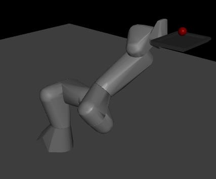

# Franka Tray RL

This repository contains a custom MuJoCo + Gym environment for robotic manipulation with a Franka Panda arm, where the robot holds a tray and must balance/manipulate a cylinder for reinforcement learning research.

    📂 Repository Structure
    franka_tray_rl/
    │
    ├── assets/                     # Models & meshes
    │   ├── panda_tray/             # Panda + tray assets
    │   │   ├── hand.stl
    │   │   ├── link0.stl ... link7.stl   # Panda STL meshes
    │   │   ├── panda_tray.urdf     # URDF definition of Panda + Tray
    │   │   ├── panda_tray_cylinder.xml # MJCF (MuJoCo) with tray + cylinder
    |   │   ├── panda_tray_cylinder_camera.xml
    |   │   └── panda_tray_cylinder_torque.xml
    │   ├── panda/
    │   └── tray/ 
    │
    ├── debug/                      # Standalone debugging scripts
    │   ├── check_urdf_xml.py       # Check whether urdf and xml is the same - essential for using URDF with pybullet to get IK solutions for XML
    │   ├── fk_generator.py         # Generates forward kinematics
    |   ├── ik_generator.py         # Generates inverse kinematics
    │   ├── interactive_ik.py       # Interactive IK exploration
    │   ├── urdf_viewer.py          # Loads URDF in viewer
    │   └── xml_viewer.py           # Loads XML in MuJoCo viewer
    │
    ├── docs/  
    │   └── TrayPose.md             # Explain TrayPose environment
    |
    ├── envs/                       # OpenAI Gym environments
    │   ├── torquesensor/           # (Future: Replace cylinder state with noisy torque sensor readings on both horizontal axes [2])
    │   └── traypose/               # Main tray manipulation environment
    │       ├── __init__.py
    │       ├── config.yaml         # Config file (parameters)
    │       └── traypose_env.py     # Core `TrayPoseEnv` class
    │
    ├── jointpos/                   # Placeholder for joint position values to define start & goal pose
    │   └── config.txt              # Tested start and goal position info
    ├── scripts/                    # Runnable scripts
    │   ├── torquesensor/
    │   └── traypose/
    |       ├── pd_tuning.py            # Grid search for PD parameters
    |       ├── test_trainpose.py       # Test train models
    |       ├── train_traypose.py       # Train models
    │       └── visualize_traypose.py   # Demo script with MuJoCo viewer
    │
    └── training/                   # Folder for RL training data

## 🦾 Environment: 
### 1. TrayPoseEnv
- [Document](docs/TrayPose.md)
- [Code](envs/traypose/traypose_env.py)

## ⚙️ Setup

    git clone git@github.com:Thinkminator/franka_tray_rl.git
    cd franka_tray_rl

Setup Conda Environment:

    conda env create -f environment.yml
    conda activate franka_tray_rl

## 🚀 Running a Env Demo

Visualize the tray-cylinder environment:

    python scripts/traypose/visualize_traypose.py [Mode]

- [Mode] = zero, seeded or random 
    - zero: Zero action mode (arm stays at start pose)
    - random: Random action mode (arm moves randomly)
    - seeded: Random actions with fixed RNG seed for reproducibility

A MuJoCo viewer will open showing the Panda arm holding the tray.
A red cylinder will spawn above the tray.
Random actions will move the tray.

## 🧠 Running a Network model (No viewer render)

To see a forward and backward pass with network update:

    python Network/Net_demo.py
    
## 🧠 Training a model(Pytorch based, no viewer render)

Perform training loop with Pytorch:

    python Network/Torch_train.py

## 🧠 Training a model (SB3, no viewer render)

Perform training loop with Stable Baseline 3:

    python scripts/traypose/train_traypose.py

## 🧠 Testing a model (SB3, with viewer render)

To evaluate a model:

    python scripts/traypose/test_trainpose.py

## 🧠 Next Steps (RL Training)

Tuning of the hyperparameter and reward structure to ensure valid training 

📌 TODO roadmap
- Add torque-sensor env
- Release pre-trained models
- [Future] Integrate RGB-D camera inputs (depthcamera env) to track cylinder
